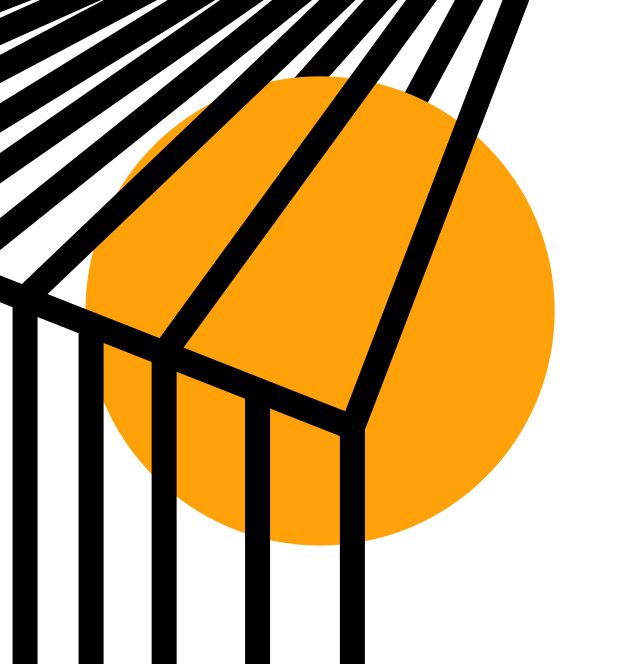

# gwen.works

:: fr

Mon site personnel, qui regroupe mes projets, mes articles et mes expériences. Vous êtes dessus en ce moment même!

[Code source](https://github.com/gwennlbh/portfolio)

Fait avec [Ortfo](/ortfo), un système de gestion d'articles de portfolios que j'ai créé

Mon portfolio est un terrain de jeu pour l'exploration des technologies web, et a donc été beaucoup réécrit au final des années :

- 2025 avec [Astro](https://astro.build) et [ortfo/db](https://github.com/ortfo/db)
- 2023 avec [Go Templ](https://templ.guide) et [ortfo/db](https://github.com/ortfo/db)
- 2021 avec [ortfo/mk](https://github.com/ortfo/mk-old) et [ortfo/db](https://github.com/ortfo/db)
- 2020 avec [Nuxt](https://nuxt.com) seul
- 2020 avec [Nuxt](https://nuxt.com) et [django rest framework](https://www.django-rest-framework.org/)
- 2020 avec [Vue.js](https://vuejs.org) et [django](https://djangoproject.com)
- 2019 avec [Django](https://djangoproject.com)
- 2018 avec [PHP](https://php.net) (premier projet web ^^)

:: en

My personal website, which gathers my projects, my articles and my experiences. You are on it right now!

[Source code](https://github.com/gwennlbh/portfolio)

Made with [Ortfo](/ortfo), a portfolio article management system I created.

my portfolio is a playground for web dev tech exploration, and has thus been rewritten an unreasonable amount of times:

- 2025 with [Astro](https://astro.build) and [ortfo/db](https://github.com/ortfo/db)
- 2023 with [Go Templ](https://templ.guide) and [ortfo/db](https://github.com/ortfo/db)
- 2021 with [ortfo/mk](https://github.com/ortfo/mk-old) and [ortfo/db](https://github.com/ortfo/db)
- 2020 with [Nuxt](https://nuxt.com) alone
- 2020 with [Nuxt](https://nuxt.com) and [django rest framework](https://www.django-rest-framework.org/)
- 2020 with [Vue.js](https://vuejs.org) and [django](https://djangoproject.com)
- 2019 with [Django](https://djangoproject.com)
- 2018 with [PHP](https://php.net) (first webdev project ^^)
